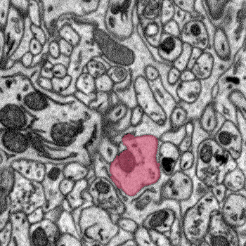

celltracer
==========

Traces cells through 3D electron microscopy images with help from Mechanical Turk users. See connectomics.

This is a new program and not fully written yet but it can be used.

A "data" directory with an example stack of images is included with the code for demonstration.

Windows example:
<code>python data O:\images\neuropil\data3 I:\dp2_output --zprocess --submit --sigma=4 --level=0.5</code>

Linux example:
<code>python data /home/rgiuly/output/paper_cerebellum --zprocess --submit --sigma=4 --level=0.5</code>

This bit of the code in dseg.py controls what processes will run:
<pre>
            if 0: initializeVolumes()
            if 0: initializeZEdges()
            if 0: makeAllRegions(initialSegFolder, inputFileExtension=inputFileExtension)
            if 0: renderAllRegions(loadImageStack(inputStack, None), 1)
            if 0: initializeRequestLoop()
            if 1: requestLoop()
</pre>

Set all to 1 (true) to run all steps. That's what you do to initalize the process.

You can run with just requestLoop() after the initialization completes one time. This is how you would typically recover/continue the process of collecting answers from mechnical turk users.

References:
<a href=http://www.google.com/url?sa=t&rct=j&q=&esrc=s&source=web&cd=1&cad=rja&ved=0CC0QFjAA&url=http%3A%2F%2Fbioinformatics.oxfordjournals.org%2Fcontent%2Fearly%2F2013%2F04%2F09%2Fbioinformatics.btt154.short%3Frss%3D1&ei=7lPqUb_2L8mdiALG5oG4Bw&usg=AFQjCNHYRwppTTr_obD9Vy_2qbD51qfKDA&sig2=-66Tfqq48_DTn4gk5x2dww&bvm=bv.49478099,d.cGE> DP2: Distributed 3D Image Segmentation Using Micro-labor Workforce </a>
