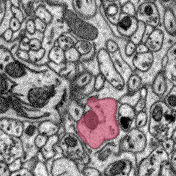
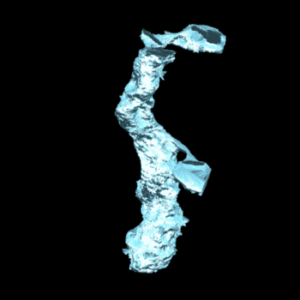

celltracer
==========

Traces cells through 3D electron microscopy images with help from Mechanical Turk users. See connectomics.

This is a new program and not fully written yet but it can be used.

A "data" directory with an example stack of images is included with the code for demonstration.

Windows example:
 <pre>
cd dseg 
python dseg.py data O:\images\neuropil\data3 I:\dp2_output --zprocess --submit --sigma=4 --level=0.5 --access_key=YOURACCESSKEY --secret_key=YOURSECRETKEY --init
</pre>

Linux example:
 <pre>
cd dseg 
python dseg.py data /home/rgiuly/output/paper_cerebellum --zprocess --submit --sigma=4 --level=0.5 --access_key=YOURACCESSKEY --secret_key=YOURSECRETKEY --init
</pre>

To initially start the process from the beginning, use "--init". This will create initial superpixels and collect from users.
python dseg.py data /home/rgiuly/output/test4 --zprocess --submit --sigma=4 --level=0.5 --access_key=X --secret_key=X --init --seeds=[[473,44,10],[425,465,10]]

Leave out --init if you want to continue a run:
python dseg.py data /home/rgiuly/output/test4 --zprocess --submit --sigma=4 --level=0.5 --access_key=X --secret_key=X --seeds=[[473,44,10],[425,465,10]]

You can run with just requestLoop() after the initialization completes one time. This is how you would typically recover/continue the process of collecting answers from mechnical turk users.
python dseg.py data /home/rgiuly/output/test4 --zprocess --submit --sigma=4 --level=0.5 --access_key=X --secret_key=X --restart --seeds=[[473,44,10],[425,465,10]]

You can manually exclude nodes from the output:
--delete=[\'116_26\',\'116_14\',\'115_47\']

<a href=http://bioinformatics.oxfordjournals.org/content/29/10/1359> DP2: Distributed 3D Image Segmentation Using Micro-labor Workforce </a>
